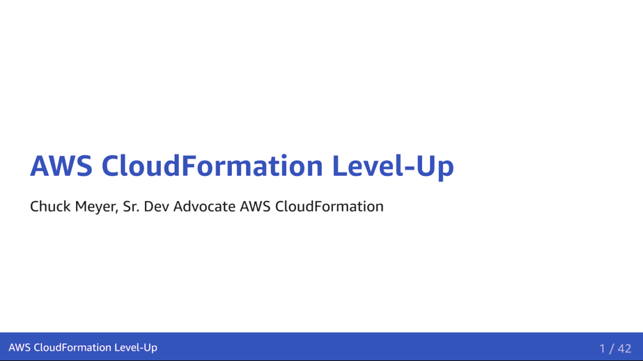

# PRESENTATION: AWS CloudFormation Level-Up

> CloudFormation is AWS' native infrastructure as code service. This presentation walks you through the process of authoring, deploying and testing your CloudFormation-driven AWS infrastructure, with opportunities to level-up your skill set along the way.

## Notes 

This presentation is written in markdown using [remark](https://github.com/gnab/remark) and [backslide](https://github.com/sinedied/backslide).

Slides are in the `presentation.md`. Style sheets are in `templates/`. All graphic assets are stored in the `assets/` directory.

You'll need backslide installed to build new PDF versions: (`npm install -g backslide`), then run `build.sh`.

To present the slides directly from the markdown, run `bs serve` from this directory.

You can also build an animated GIF of your presentation, but you need ImageMagick (`convert`) and Ghost Script (`gs`).
With those tools installed, you can execute `build-gif.sh`
