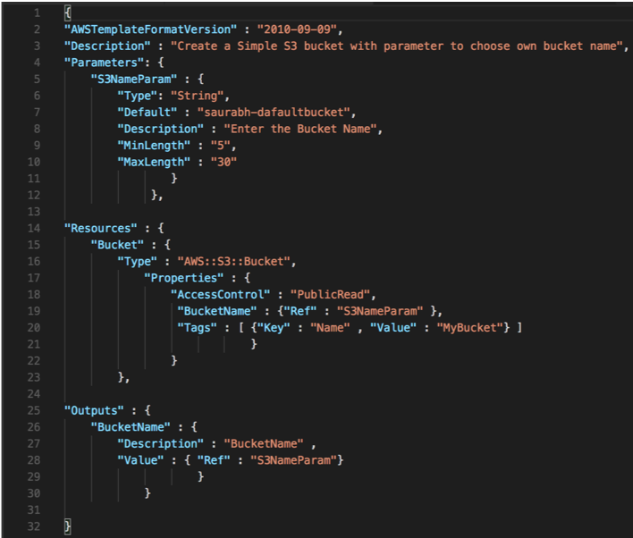
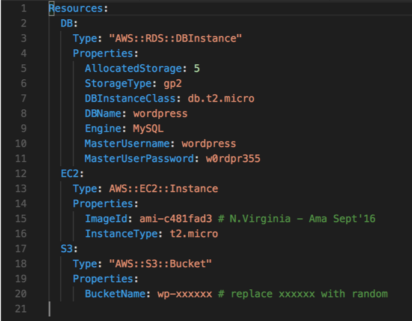

title: AWS CloudFormation Level-Up
class: animation-fade
layout: true
resources: 342

<!-- This slide will serve as the base layout for all your slides -->
.bottom-bar[
  {{title}}
]

---
<!-- class: impact -->
class: left, middle

# {{title}}
Chuck Meyer, Sr. Dev Advocate AWS CloudFormation

---
name: Agenda

# Agenda

## Intro

--

## Authoring

--

## Deploying
--

##Testing

--

## Demos

---
name: Intro
class: left, middle

# {{name}}

---
name: Bio

# Who I am

 

**Chuck Meyer**  
[cmmeyer@amazon.com](mailto:cmmeyer@amazon.com)  
Sr Developer Advocate, AWS CloudFormation

* 5+ years at AWS
* Major: Infrastructure as code and DevOps
* Minor: Security automation / DevSecOps
* 20+ Years in Technology
* Bass player

@[chuckm](https://twitter.com/chuckm)

---

# Infrastructure as code

*Declarative or imperative statements describing hardware, software and services and their relationships.*

--

```yaml
Resource: MyWebServer
    Class: Server
    Type: ExtraBig
    Ports:
        - 443
```

--

```python
server_names = [ 'Red', 'Blue', 'Green']
for name in server_names:
    launch_server(name, 'web')
```

---

# Infrastructure as code

- **Single source** of truth for provisioning and configuration

- Infrastructure that you can **replicate**, **re-deploy**, and **re-purpose**

- Control **versioning** on your infrastructure and your application together

- **Roll back** to the last good state on failures

- Build and deploy your infrastructure through your **CI/CD** pipeline

---

# AWS CloudFormation

.col-4[

]
.col-8[
- A simplified way to create and manage a collection of AWS resources

- Enables orderly and predictable provisioning and updating of resources

- Enables version control of your AWS infrastructure

- Integrates with the AWS Management Console, the AWS Command Line Interface (CLI), or AWS APIs

- Only pay for the resources you create
]

---
background-image: url(assets/cfn-diagram.png)
background-position: right
background-repeat: no-repeat
background-size: contain

# CloudFormation at a glance

Enables provisioning and management of your infrastructure as code

---
name: Authoring
class: left, middle

# {{name}}

---

# CloudFormation syntax

.col-6[
## JSON
  - JavaScript Object Notation
  - Attribute/Value pairs
  - Similar to XML
  - Designed to be machine readable
]

.col-6[

]

---

# CloudFormation syntax

.col-6[
## YAML
  - YAML ain't a markup language
  - **Human readable** data serialization standard
  - Comments (use *#*)
  - No `}` or `;`
]

.col-6[

]

---

# CloudFormation syntax

.col-6[
## Template Anatomy
]

.col-6[
1. .primary[Format version]
2. .alt[Transforms]
3. .primary[Description]
4. .alt[Metadata]
5. .primary[Parameters]
6. .alt[Mappings]
7. .primary[Conditions]
8. .alt[Resources* (required)]
9. .primary[Outputs]
]

.small[[https://docs.aws.amazon.com/AWSCloudFormation/latest/UserGuide/template-anatomy.html](https://docs.aws.amazon.com/AWSCloudFormation/latest/UserGuide/template-anatomy.html)]

---

.small[
```YAML
---
AWSTemplateFormatVersion: '2010-09-09'
Description: Create an EC2 instance running the latest Amazon Linux AMI.
Parameters:
  KeyPair:
    Description: The EC2 Key Pair to allow SSH access to the instance
    Type: String
Resources:
  Ec2Instance:
    Properties:
      ImageId: ami-9d23aeea
      InstanceType: m3.medium
      KeyName: !Ref 'KeyPair'
    Type: AWS::EC2::Instance
Outputs:
  InstanceId:
    Description: The InstanceId of the newly created EC2 instance
    Value: !Ref 'Ec2Instance'
```
]
---

# Simple template – create EC2 instance

.small[
```yaml
Parameters:
  KeyPair:
    Description: 'The EC2 Key Pair to allow SSH access to the instance'
    Type: 'AWS::EC2::KeyPair::KeyName'
```
]

You enter a value for the `KeyPair` parameter when you create your stack.

---

# Simple template – create EC2 instance

.small[
```yaml
Resources:
  Ec2Instance:
    Type: 'AWS::EC2::Instance'
    Properties:
      ImageId: 'ami-9d23aeea'
      InstanceType: 'm3.medium'
      KeyName: !Ref 'KeyPair'
```
]

Includes statically defined properties (`ImageId` and `InstanceType`) and a reference to the `KeyPair` parameter.

`ImageId` is the AMI specific to the region that you want to launch this stack in (eu-west-1 region in this example)

---

# Simple template – create EC2 instance

.small[
```yaml
Outputs:
  InstanceId:
    Description: 'The InstanceId of the newly created EC2 instance'
    Value: !Ref 'Ec2Instance'
```
]

These outputs are returned after the template has completed execution.

---

# CloudFormation syntax – Resources

- The only section of the template that is **required**

- AWS services that will be created, updated, or deleted from your account

- Supports .alt[{{resources}} resource types] (and growing)

.small[
```yaml
Resources:
  Ec2Instance:
    Type: 'AWS::EC2::Instance'
    Properties:
      ImageId: 'ami-9d23aeea'
      InstanceType: 'm3.medium'
      KeyName: !Ref 'KeyPair'
```
]

---

# CloudFormation syntax – Parameters

- Enable you to input custom values to your template each time you create or update a stack with input validation and restrictions.

- Parameter types: `String`, `Number`, `List<Number>`, `CommaDelimitedList`, `Parameter Store` values, and  AWS-specific types (`AWS::EC2::Image::Id`, `AWS::Route53::HostedZone::Id`).

- Use the `Ref` and `Fn::Sub` intrinsic functions to reference parameters.

- Pseudo-Parameters are predefined by AWS CloudFormation and used just like normal parameters (`AWS::Region`)

---

# Intrinsic functions

Basic programmatic functions available in-line for your declarative templates.

- Retrieve external values (`Ref, Fn::Sub, Fn::FindInMap, Fn::GetAtt, Fn::GetAZs`)

- Manipulate strings (`Fn::Sub, Fn::Split, Fn::Join, Fn::Base64, Fn::Transform`)

- Conditional logic (`Fn::If, Fn::Equals, Fn::Not`)

---

# Dynamic references

- Inject values from .alt[SSM Parameter Store] and .alt[Secrets Manager]
- .alt[KMS] encrypted strings
- Versioned and secured by .alt[IAM]

.small[
```yaml
MyIAMUser:
     Type: AWS::IAM::User
     Properties:
       UserName: 'MyUserName’
       LoginProfile:
         Password: '{{resolve:ssm-secure:IAMUserPassword:10}}'
```
]

---

# CloudFormation syntax - Conditions

Resource creation can depend on logical conditions:

.small[
```yaml
Conditions:
  isProd: Fn::Equals [ !Ref EnvType, prod ]
Resources: 
  EC2Instance: 
    Type: "AWS::EC2::Instance"
    Condition: isProd
    Properties: 
      ImageId: Fn::FindInMap [RegionMap, !Ref "AWS::Region", AMI]
```
]

You can use conditions with intrinsic functions (`Fn::If, Fn::Equals, Fn::Not`) to create complex logic for property values.

---

# CloudFormation syntax - Outputs

- Outputs from successful operations

- View them in the console or pass them along as inputs to other stacks

- Used with .alt[nested stacks] and .alt[cross stack references]

.small[
```yaml
Outputs:
  Environment:
    Description: 'Environment type'
    Value:
      Fn:If: [ isProd, 'Production', 'Development' ]
```
]

---
name: Deploying
class: left, middle

# {{name}}

---
